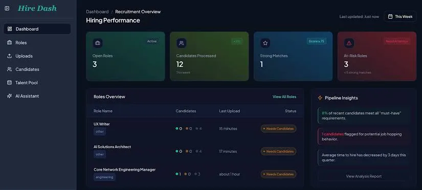
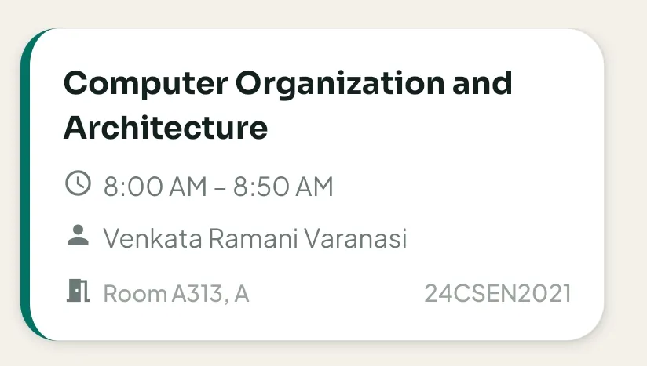
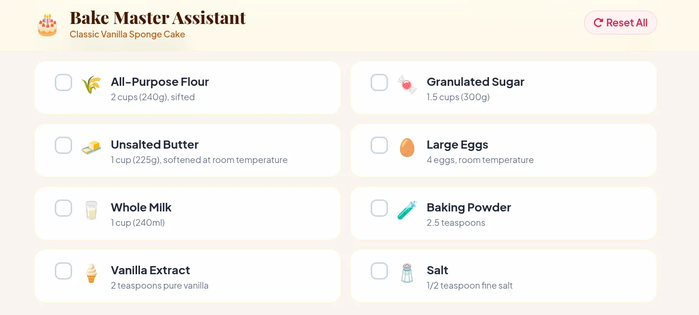
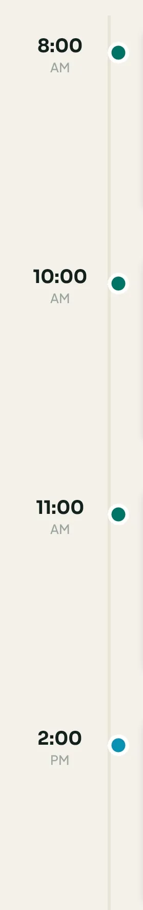
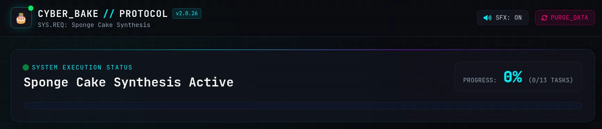
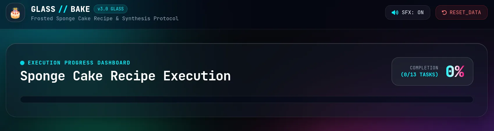

# Deslopify

For each code and UX smell below, use one subagent each to eliminate it.
Use the same rule for each writing smell.

Inspect the product or draft before you make changes. Report only the smells that you find. Give each subagent one smell and the relevant files. Ask it to make a focused change. Review each change against the purpose and existing style. Check UI changes at the supported screen sizes. Test the main task with a keyboard. Read writing changes in context. Keep the author's point of view and meaning. Do not treat these signs as proof of AI use. Do not remove a useful feature or phrase only because it matches a pattern below.

Use this format for each finding and its repair. Omit the image when it adds no information.
The images in `assets/` show examples of the first nine UI smells. Open an image when the written description is unclear.

Title
Description
Optional image

—

## Gradients everywhere

Description: Find gradients that have no clear purpose. Remove repeated gradients from buttons and backgrounds. Keep a gradient if it helps the user see state or hierarchy.

—

## Too many colours

Description: Find colours that have no consistent meaning. Use a small palette. Give each status and action a stable colour. Check contrast after the change.

—

## Pulsing badges

Description: Find animated badges and labels that state the obvious. Remove them when the state cannot change or gives no useful information. Keep motion only when it signals a real change.

—

## Fingernail cards

Description: Find cards with a small coloured tab or bar on the edge. Remove the decoration when it has no meaning. Use a clear label or layout if the cards need distinction.

—

## Excess emoji

Description: Find emoji that do not help the user understand an action or state. Remove them from labels, headings, and status text. Use a consistent icon only when needed.

—

## Misaligned elements

Description: Check icons, SVGs, art, labels, and list items. Align them to the same grid and baseline. Check the layout at narrow and wide screen sizes.

—

## Default font choices

Description: Check whether the font fits the product and remains easy to read. Do not use Inter or JetBrains Mono only because they are common defaults. Remove decorative code marks such as `//` when they have no meaning.

—

## Redundant text

Description: Find text or code comments that repeat the brief, build choices, or instructions to the agent. Remove them when they do not help the reader act or maintain the code.

—

## Glass effects without purpose

Description: Find blur and translucent panels that reduce clarity. Use solid surfaces when they improve contrast and reading. Keep a glass effect only when it supports the design and remains accessible.

—

## Generic claims and hype

Description: Find broad claims, stock slogans, long introductions, and welcome text that give no useful information. Name the task, result, or next action in plain words. Make the main action easy to find.

—

## Excess em dashes

Description: Find em dashes used for routine pauses or drama. Keep them when they help the sentence. Use a full stop or comma when it reads better.

—

## Forced sass

Description: Find staged conflict and phrases such as "But here's the thing". State the point directly. Keep a sharp tone only when it fits the author and audience.

—

## Repeated buzzwords

Description: Find vague words such as "unlock", "elevate", "delve", and "navigate". Replace them with exact actions or facts. Keep a word when its meaning is clear and needed.

—

## Cliché openings

Description: Find stock openings about fast change, a dynamic landscape, or looming challenges. Start with the subject and a specific fact. Keep an opening when it serves the reader.

—

## Formulaic structure

Description: Find forced lists of three, repeated contrasts, and sudden bullet lists. Use only the points that matter. Write in paragraphs when a list does not help.

—

## Model self-reference

Description: Find phrases that say the writer is a language model. Remove them from user-facing text.

—

## Unclear task flow

Description: Find screens where users cannot see the main task or the next step. Put related information together. Remove decoration that blocks navigation or action. Check that a user can finish the task.

—

## Inconsistent controls

Description: Compare buttons, fields, spacing, and headings with the product's design rules. Use the same style for the same function. Make the primary action clear.

—

## Hard-to-read labels

Description: Find long strings in all caps, wide letter spacing, or small type. Use a readable case, size, and spacing. Keep uppercase labels when they fit the design and remain clear.

—

## Hidden content

Description: Open menus, answers, and other interactive content. Check that text stays visible above its background. Fix clipping and contrast in each supported browser and screen size.

—

## Distracting motion

Description: Find effects that fade, move, or restart while the user reads or works. Remove motion that has no clear purpose. Keep motion that explains a change or helps navigation.

—

## Excess containers and metrics

Description: Find cards inside cards, unused statistics, and status blocks that do not support a task. Simplify the layout. Keep data and grouping that help a decision.

—

## Mobile and keyboard failures

Description: Check narrow screens for clipped navigation, text, and code blocks. Check focus order and visible focus with a keyboard. Make long content scroll inside its area when needed.

—
